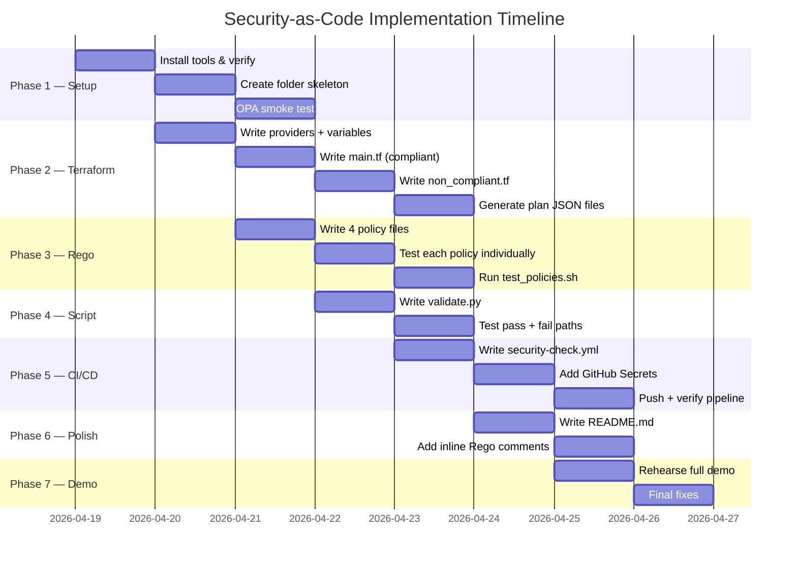

# Security-as-Code: Policy as Code — Implementation Plan

> **Scope Document:** `Security-as-Code_Project_Scope_and_Plan.md`
> **Timeline:** 7 days | **Solo** | **Zero AWS cost** (plan-only, never apply)

---

## Overview

This plan implements a Security-as-Code pipeline that uses **Open Policy Agent (OPA)** to evaluate **Terraform plans** before any deployment occurs. Non-compliant infrastructure changes are blocked automatically by a **GitHub Actions** CI/CD pipeline. No AWS resources are ever created or modified.

---

## User Review Required

> [!IMPORTANT]
> **AWS Credentials** — The pipeline runs `terraform plan`, which requires AWS credentials. These must be stored as **GitHub Secrets** (`AWS_ACCESS_KEY_ID`, `AWS_SECRET_ACCESS_KEY`, `AWS_DEFAULT_REGION`). You need a personal AWS account (free tier). Credentials are never used to deploy; only to generate a valid plan JSON.

> [!IMPORTANT]
> **OPA CLI** — Must be installed locally for Day 3 iterative policy testing. The CI pipeline downloads it automatically. On Windows, OPA is a single `.exe` binary — no installer needed.

> [!WARNING]
> **Terraform on Windows** — Terraform requires `terraform.exe` available on `PATH`. The `terraform plan -out=tfplan` command and `terraform show -json tfplan` command must both work locally. Test this on Day 1.

---

## Final Repository Structure

Every file listed below will be created. No placeholders.

```
OPA-code-as-security/
│
├── .github/
│   └── workflows/
│       └── security-check.yml        # GitHub Actions CI/CD pipeline
│
├── terraform/
│   ├── providers.tf                  # AWS provider + backend config
│   ├── main.tf                       # Compliant resources (pass policies)
│   ├── non_compliant.tf              # Intentionally insecure (trigger violations)
│   └── variables.tf                  # Shared input variables
│
├── policies/
│   ├── s3_encryption.rego            # Policy 1: S3 must have SSE enabled
│   ├── ssh_access.rego               # Policy 2: No port 22 open to 0.0.0.0/0
│   ├── iam_wildcard.rego             # Policy 3: No wildcard (*) IAM actions
│   └── s3_public_access.rego         # Policy 4: S3 must have public access block
│
├── scripts/
│   └── validate.py                   # Glue script: plan → JSON → OPA → report
│
├── tests/
│   ├── plan_compliant.json           # Sample compliant plan JSON (for local testing)
│   ├── plan_non_compliant.json       # Sample non-compliant plan JSON (for local testing)
│   └── test_policies.sh              # Shell script to run all OPA tests locally
│
├── reports/
│   └── .gitkeep                      # Directory preserved; actual reports are gitignored
│
├── .gitignore                        # Already exists; will be extended
├── README.md                         # Setup guide, architecture, demo walkthrough
└── Security-as-Code_Project_Scope_and_Plan.md  # Already exists
```

---

## Phase 1 — Environment Setup & OPA Basics (Day 1)

### Goals
- Repository is structured correctly
- OPA CLI works locally
- Terraform CLI works locally
- First "hello world" Rego rule tested

### 1.1 — Extend `.gitignore`

**File:** `.gitignore` *(existing — extend)*

Add the following entries:
```gitignore
# Terraform
.terraform/
.terraform.lock.hcl
terraform.tfstate
terraform.tfstate.backup
tfplan
*.tfplan

# OPA / reports
reports/*.json
reports/*.txt

# Python
__pycache__/
*.pyc
.env
```

### 1.2 — Create Directory Skeleton

Create all directories manually or via script:
```
mkdir terraform policies scripts tests reports .github\workflows
```

Add a `.gitkeep` inside `reports/` so it's tracked by Git even when empty.

### 1.3 — Tool Installation Checklist

| Tool | Install Command / Source | Verify With |
|------|--------------------------|-------------|
| **Terraform** | https://developer.hashicorp.com/terraform/install | `terraform -version` |
| **OPA CLI** | https://www.openpolicyagent.org/docs/latest/#running-opa | `opa version` |
| **Python 3.9+** | https://python.org or already installed | `python --version` |
| **AWS CLI** | https://aws.amazon.com/cli/ | `aws configure` |

> All tools must be on `PATH`. Test every `verify` command before Day 2.

### 1.4 — OPA "Hello World" Smoke Test

Create a throwaway file `scratch_test.rego` in any temp folder:
```rego
package example

default allow = false

allow if {
    input.role == "admin"
}
```
Run: `opa eval -i '{"role":"admin"}' -d scratch_test.rego "data.example.allow"`
Expected output: `{"result": [{"expressions": [{"value": true, ...}]}]}`

Delete the scratch file once confirmed working.

---

## Phase 2 — Terraform Configurations (Day 2)

### Goals
- Four AWS resource types declared in HCL (compliant + non-compliant variants)
- `terraform init` succeeds
- `terraform plan -out=tfplan && terraform show -json tfplan > plan.json` produces valid JSON
- Plan JSON structure understood (required for writing Rego on Day 3)

### 2.1 — `terraform/providers.tf`

```hcl
terraform {
  required_version = ">= 1.5.0"

  required_providers {
    aws = {
      source  = "hashicorp/aws"
      version = "~> 5.0"
    }
  }
}

provider "aws" {
  region = var.aws_region
}
```

### 2.2 — `terraform/variables.tf`

```hcl
variable "aws_region" {
  description = "AWS region to target"
  type        = string
  default     = "us-east-1"
}

variable "project_name" {
  description = "Prefix for all resource names"
  type        = string
  default     = "sec-as-code"
}
```

### 2.3 — `terraform/main.tf` — Compliant Resources

Contains **four** resources, one per policy, all written to pass every policy check:

| Resource | Type | Compliant Because |
|----------|------|-------------------|
| `aws_s3_bucket.compliant` | S3 bucket | Has SSE AES256 configured |
| `aws_s3_bucket_public_access_block.compliant` | S3 PAB | All four block flags = `true` |
| `aws_security_group.compliant` | Security group | Port 22 restricted to a private CIDR (not 0.0.0.0/0) |
| `aws_iam_policy.compliant` | IAM policy | Actions list only specific actions, no `*` |

Full HCL content (to be written exactly as follows):

```hcl
# ─── S3: Compliant Bucket ────────────────────────────────────────────────────
resource "aws_s3_bucket" "compliant" {
  bucket = "${var.project_name}-compliant-bucket"

  server_side_encryption_configuration {
    rule {
      apply_server_side_encryption_by_default {
        sse_algorithm = "AES256"
      }
    }
  }

  tags = { Name = "compliant-bucket", Environment = "demo" }
}

# ─── S3: Public Access Block ─────────────────────────────────────────────────
resource "aws_s3_bucket_public_access_block" "compliant" {
  bucket = aws_s3_bucket.compliant.id

  block_public_acls       = true
  block_public_policy     = true
  ignore_public_acls      = true
  restrict_public_buckets = true
}

# ─── Security Group: Compliant (SSH restricted to private CIDR) ───────────────
resource "aws_security_group" "compliant" {
  name        = "${var.project_name}-compliant-sg"
  description = "Compliant: SSH restricted to private network only"

  ingress {
    description = "SSH from private network only"
    from_port   = 22
    to_port     = 22
    protocol    = "tcp"
    cidr_blocks = ["10.0.0.0/8"]   # Private range — not 0.0.0.0/0
  }

  egress {
    from_port   = 0
    to_port     = 0
    protocol    = "-1"
    cidr_blocks = ["0.0.0.0/0"]
  }

  tags = { Name = "compliant-sg" }
}

# ─── IAM Policy: Compliant (no wildcard actions) ──────────────────────────────
resource "aws_iam_policy" "compliant" {
  name        = "${var.project_name}-compliant-policy"
  description = "Compliant: specific actions only, no wildcards"

  policy = jsonencode({
    Version = "2012-10-17"
    Statement = [{
      Effect   = "Allow"
      Action   = ["s3:GetObject", "s3:PutObject", "s3:ListBucket"]
      Resource = "arn:aws:s3:::${var.project_name}-*"
    }]
  })
}
```

### 2.4 — `terraform/non_compliant.tf` — Intentionally Insecure Resources

Contains **four** resources that each violate one policy:

| Resource | Type | Violation |
|----------|------|-----------|
| `aws_s3_bucket.no_encryption` | S3 bucket | No `server_side_encryption_configuration` block |
| `aws_s3_bucket_public_access_block.not_blocked` | S3 PAB | All four block flags = `false` |
| `aws_security_group.public_ssh` | Security group | Port 22 open to `0.0.0.0/0` |
| `aws_iam_policy.wildcard` | IAM policy | Action = `"*"` |

Full HCL content:

```hcl
# VIOLATION 1: S3 bucket with no encryption
resource "aws_s3_bucket" "no_encryption" {
  bucket = "${var.project_name}-no-encryption-bucket"
  # Intentionally missing server_side_encryption_configuration block
  tags = { Name = "non-compliant-no-encryption" }
}

# VIOLATION 2: Public access block with all flags false
resource "aws_s3_bucket_public_access_block" "not_blocked" {
  bucket = aws_s3_bucket.no_encryption.id

  block_public_acls       = false   # VIOLATION
  block_public_policy     = false   # VIOLATION
  ignore_public_acls      = false   # VIOLATION
  restrict_public_buckets = false   # VIOLATION
}

# VIOLATION 3: SSH open to the world
resource "aws_security_group" "public_ssh" {
  name        = "${var.project_name}-public-ssh-sg"
  description = "Non-compliant: SSH open to 0.0.0.0/0"

  ingress {
    description = "SSH open to the internet"
    from_port   = 22
    to_port     = 22
    protocol    = "tcp"
    cidr_blocks = ["0.0.0.0/0"]   # VIOLATION
  }

  tags = { Name = "non-compliant-sg" }
}

# VIOLATION 4: IAM policy with wildcard action
resource "aws_iam_policy" "wildcard" {
  name        = "${var.project_name}-wildcard-policy"
  description = "Non-compliant: wildcard action"

  policy = jsonencode({
    Version = "2012-10-17"
    Statement = [{
      Effect   = "Allow"
      Action   = "*"          # VIOLATION
      Resource = "*"
    }]
  })
}
```

### 2.5 — Generate the Plan JSON

Commands to run locally (from inside `terraform/`):
```bash
terraform init
terraform plan -out=tfplan
terraform show -json tfplan > ../tests/plan_non_compliant.json
```

Then comment out `non_compliant.tf` resources or rename the file and regenerate:
```bash
terraform plan -out=tfplan
terraform show -json tfplan > ../tests/plan_compliant.json
```

> **Critical:** Study the JSON structure of `plan_non_compliant.json` before Day 3. The key path for resources is:
> `input.resource_changes[_]` where `change.actions` contains `"create"` or `"update"`.
> The actual resource config lives at `change.after`.

---

## Phase 3 — Rego Policies (Day 3)

### Goals
- All 4 `.rego` policy files written
- Each tested individually using `opa eval` against `plan_non_compliant.json`
- False positives verified against `plan_compliant.json`

### Rego Package Naming Convention

All policies share the same package for easy bulk evaluation:
```
package terraform.security
```

Each policy file defines a **`deny`** set. The glue script collects all deny messages across all policy files.

---

### 3.1 — `policies/s3_encryption.rego`

**Logic:**
- Iterate all `resource_changes` where `type == "aws_s3_bucket"` AND `change.actions` contains `"create"` or `"update"`
- Check if `change.after.server_side_encryption_configuration` is missing OR if `apply_server_side_encryption_by_default.sse_algorithm` is missing
- Emit a denial message with the bucket name

**Full file:**
```rego
# policies/s3_encryption.rego
#
# Policy: S3 Encryption Required
# Denies any aws_s3_bucket resource that does not have server-side
# encryption (AES256 or aws:kms) configured.

package terraform.security

import future.keywords.contains
import future.keywords.if

deny contains msg if {
    resource := input.resource_changes[_]
    resource.type == "aws_s3_bucket"
    modifying_action(resource.change.actions)

    # Check: no SSE configuration block at all, OR algorithm is absent
    not valid_sse(resource.change.after)

    msg := sprintf(
        "DENY [S3 Encryption] Bucket '%s' does not have server-side encryption enabled. Add a server_side_encryption_configuration block with AES256 or aws:kms.",
        [resource.name]
    )
}

# Helper: returns true if the resource config has a valid SSE algorithm
valid_sse(config) if {
    algo := config.server_side_encryption_configuration[_].rule[_].apply_server_side_encryption_by_default[_].sse_algorithm
    algo in {"AES256", "aws:kms"}
}

# Helper: actions that change state (create or update)
modifying_action(actions) if {
    actions[_] in {"create", "update"}
}
```

---

### 3.2 — `policies/ssh_access.rego`

**Logic:**
- Iterate all `resource_changes` where `type == "aws_security_group"`
- For each `ingress` rule, check if `from_port <= 22 <= to_port` AND `"0.0.0.0/0"` is in `cidr_blocks`
- Deny if both conditions are true

**Full file:**
```rego
# policies/ssh_access.rego
#
# Policy: No Public SSH Access
# Denies any aws_security_group that permits inbound SSH (port 22)
# from any IPv4 address (0.0.0.0/0).

package terraform.security

import future.keywords.contains
import future.keywords.if

deny contains msg if {
    resource := input.resource_changes[_]
    resource.type == "aws_security_group"
    modifying_action(resource.change.actions)

    ingress := resource.change.after.ingress[_]
    ingress.from_port <= 22
    ingress.to_port   >= 22
    "0.0.0.0/0" in ingress.cidr_blocks

    msg := sprintf(
        "DENY [SSH Access] Security group '%s' allows SSH (port 22) from 0.0.0.0/0. Restrict to a known CIDR range.",
        [resource.name]
    )
}

modifying_action(actions) if {
    actions[_] in {"create", "update"}
}
```

---

### 3.3 — `policies/iam_wildcard.rego`

**Logic:**
- Iterate all `resource_changes` where `type == "aws_iam_policy"`
- Decode the `policy` field (it is a JSON string inside the plan) using `json.unmarshal`
- For each Statement, check if `Action` is the string `"*"` OR if `"*"` is inside an Action array
- Deny if any Statement has a wildcard action

**Full file:**
```rego
# policies/iam_wildcard.rego
#
# Policy: No Wildcard IAM Actions
# Denies any aws_iam_policy that includes "*" in any Statement's Action field.
# Applies whether Action is a string "*" or an array containing "*".

package terraform.security

import future.keywords.contains
import future.keywords.if

deny contains msg if {
    resource := input.resource_changes[_]
    resource.type == "aws_iam_policy"
    modifying_action(resource.change.actions)

    # The policy field is a JSON-encoded string; decode it first
    policy_doc := json.unmarshal(resource.change.after.policy)
    statement   := policy_doc.Statement[_]

    wildcard_action(statement.Action)

    msg := sprintf(
        "DENY [IAM Wildcard] IAM policy '%s' contains a wildcard (*) Action in a statement. Use explicit, least-privilege actions.",
        [resource.name]
    )
}

# Wildcard as bare string
wildcard_action(action) if {
    action == "*"
}

# Wildcard inside an array
wildcard_action(action) if {
    "*" in action
}

modifying_action(actions) if {
    actions[_] in {"create", "update"}
}
```

---

### 3.4 — `policies/s3_public_access.rego`

**Logic:**
- Iterate all `resource_changes` where `type == "aws_s3_bucket_public_access_block"`
- Check that **all four** flags are `true`: `block_public_acls`, `block_public_policy`, `ignore_public_acls`, `restrict_public_buckets`
- Deny if **any** flag is `false` or missing

**Full file:**
```rego
# policies/s3_public_access.rego
#
# Policy: S3 Public Access Block Required
# Denies any aws_s3_bucket_public_access_block resource where at least
# one of the four block flags is not explicitly set to true.

package terraform.security

import future.keywords.contains
import future.keywords.if

deny contains msg if {
    resource := input.resource_changes[_]
    resource.type == "aws_s3_bucket_public_access_block"
    modifying_action(resource.change.actions)

    config := resource.change.after

    # At least one flag is not true — collect which ones failed
    failed := {flag |
        flag := ["block_public_acls", "block_public_policy", "ignore_public_acls", "restrict_public_buckets"][_]
        config[flag] != true
    }

    count(failed) > 0

    msg := sprintf(
        "DENY [S3 Public Access] Public access block '%s' has flags not set to true: %v. All four flags must be true.",
        [resource.name, failed]
    )
}

modifying_action(actions) if {
    actions[_] in {"create", "update"}
}
```

---

### 3.5 — Testing Rego Policies Locally

Test commands to run from the repo root (one per policy, then all together):

```bash
# Test single policy against non-compliant plan
opa eval \
  -i tests/plan_non_compliant.json \
  -d policies/s3_encryption.rego \
  "data.terraform.security.deny"

# Test all policies together (multi-file)
opa eval \
  -i tests/plan_non_compliant.json \
  -d policies/ \
  "data.terraform.security.deny"

# Confirm no false positives on compliant plan
opa eval \
  -i tests/plan_compliant.json \
  -d policies/ \
  "data.terraform.security.deny"
```

**Expected outputs:**
- Non-compliant plan → `result[0].expressions[0].value` is a **non-empty array** of deny messages
- Compliant plan → `result[0].expressions[0].value` is an **empty array** `[]`

Create `tests/test_policies.sh` to wrap these into one runnable script:

```bash
#!/usr/bin/env bash
# tests/test_policies.sh — Run all policy tests locally

set -euo pipefail

POLICIES_DIR="policies"
NON_COMPLIANT="tests/plan_non_compliant.json"
COMPLIANT="tests/plan_compliant.json"
QUERY="data.terraform.security.deny"

echo "=========================================="
echo "  OPA Policy Test Suite"
echo "=========================================="

echo ""
echo "▶ [1/2] Non-compliant plan — expecting violations..."
RESULT=$(opa eval -i "$NON_COMPLIANT" -d "$POLICIES_DIR" "$QUERY" --format raw)
echo "$RESULT"

VIOLATION_COUNT=$(echo "$RESULT" | python3 -c "import sys,json; d=json.load(sys.stdin); print(len(d))")
if [ "$VIOLATION_COUNT" -eq 0 ]; then
    echo "FAIL: Expected violations but found none."
    exit 1
fi
echo "✅ Found $VIOLATION_COUNT violation(s) — PASS"

echo ""
echo "▶ [2/2] Compliant plan — expecting zero violations..."
RESULT=$(opa eval -i "$COMPLIANT" -d "$POLICIES_DIR" "$QUERY" --format raw)
echo "$RESULT"

VIOLATION_COUNT=$(echo "$RESULT" | python3 -c "import sys,json; d=json.load(sys.stdin); print(len(d))")
if [ "$VIOLATION_COUNT" -ne 0 ]; then
    echo "FAIL: Expected zero violations but found $VIOLATION_COUNT."
    exit 1
fi
echo "✅ Zero violations — PASS"

echo ""
echo "=========================================="
echo "  All policy tests passed!"
echo "=========================================="
```

---

## Phase 4 — Python Glue Script (Day 4)

### Goals
- `scripts/validate.py` runs the full pipeline end-to-end
- Accepts a plan JSON path as argument
- Calls OPA, collects all deny messages, formats a compliance report
- Exits with code `0` (pass) or `1` (fail) — required for CI gate

### `scripts/validate.py` — Full Design

**Inputs:**
- `--plan` (required): path to Terraform plan JSON file
- `--policies` (optional, default: `policies/`): directory of `.rego` files
- `--output` (optional, default: `reports/compliance_report.txt`): where to write the report

**Logic flow:**
1. Validate that the plan file exists
2. Run `opa eval` via `subprocess` with all policy files loaded from the policies directory
3. Parse the JSON output from OPA
4. Classify each resource change as PASS or DENY
5. Print a formatted table to stdout
6. Write the report to `--output`
7. Exit `1` if any denials exist, `0` if all pass

**Full script:**

```python
#!/usr/bin/env python3
"""
scripts/validate.py
───────────────────
OPA Policy Evaluation Glue Script

Usage:
    python scripts/validate.py --plan <path_to_plan.json> [--policies <dir>] [--output <report_path>]

Exit codes:
    0  All policies passed (compliant)
    1  One or more policy violations found (non-compliant)
"""

import argparse
import json
import os
import subprocess
import sys
from datetime import datetime

# ──────────────────────────────────────────────────────────────────────────────
# Constants
# ──────────────────────────────────────────────────────────────────────────────

OPA_QUERY     = "data.terraform.security.deny"
POLICY_FILES  = "policies"
REPORT_DIR    = "reports"
REPORT_FILE   = os.path.join(REPORT_DIR, "compliance_report.txt")

SEPARATOR     = "=" * 60
SUB_SEPARATOR = "-" * 60

# ──────────────────────────────────────────────────────────────────────────────
# Argument Parsing
# ──────────────────────────────────────────────────────────────────────────────

def parse_args():
    parser = argparse.ArgumentParser(
        description="Evaluate a Terraform plan JSON against OPA security policies."
    )
    parser.add_argument(
        "--plan",
        required=True,
        help="Path to the Terraform plan JSON file (from `terraform show -json`)"
    )
    parser.add_argument(
        "--policies",
        default=POLICY_FILES,
        help="Directory containing .rego policy files (default: policies/)"
    )
    parser.add_argument(
        "--output",
        default=REPORT_FILE,
        help="Path to write the compliance report (default: reports/compliance_report.txt)"
    )
    return parser.parse_args()

# ──────────────────────────────────────────────────────────────────────────────
# OPA Evaluation
# ──────────────────────────────────────────────────────────────────────────────

def run_opa_eval(plan_path: str, policies_dir: str) -> list[str]:
    """
    Invoke OPA CLI and return the list of denial messages.
    Raises RuntimeError if OPA fails unexpectedly.
    """
    cmd = [
        "opa", "eval",
        "--format", "json",
        "--input",  plan_path,
        "--data",   policies_dir,
        OPA_QUERY,
    ]

    try:
        result = subprocess.run(
            cmd,
            capture_output=True,
            text=True,
            check=False,   # Handle non-zero exit ourselves
        )
    except FileNotFoundError:
        raise RuntimeError(
            "OPA CLI not found. Install from https://www.openpolicyagent.org/docs/latest/#running-opa"
        )

    if result.returncode not in (0, 1):
        raise RuntimeError(
            f"OPA exited with code {result.returncode}.\nSTDERR: {result.stderr}"
        )

    try:
        opa_output = json.loads(result.stdout)
    except json.JSONDecodeError as e:
        raise RuntimeError(f"Failed to parse OPA output as JSON: {e}\nOPA stdout: {result.stdout}")

    # Navigate: result[0].expressions[0].value → list of denial strings
    try:
        denials = opa_output["result"][0]["expressions"][0]["value"]
    except (KeyError, IndexError):
        # Empty result = no violations
        denials = []

    return sorted(denials)   # Sorted for deterministic report output

# ──────────────────────────────────────────────────────────────────────────────
# Report Generation
# ──────────────────────────────────────────────────────────────────────────────

def build_report(plan_path: str, denials: list[str]) -> str:
    """Build a human-readable compliance report string."""
    now       = datetime.utcnow().strftime("%Y-%m-%d %H:%M:%S UTC")
    status    = "❌  NON-COMPLIANT" if denials else "✅  COMPLIANT"
    viol_count = len(denials)

    lines = [
        SEPARATOR,
        "  SECURITY-AS-CODE — COMPLIANCE REPORT",
        SEPARATOR,
        f"  Timestamp  : {now}",
        f"  Plan File  : {plan_path}",
        f"  Status     : {status}",
        f"  Violations : {viol_count}",
        SEPARATOR,
    ]

    if denials:
        lines.append("\n  POLICY VIOLATIONS FOUND:\n")
        for i, msg in enumerate(denials, start=1):
            lines.append(f"  [{i}] {msg}")
        lines.append("")
        lines.append(SUB_SEPARATOR)
        lines.append("  ACTION REQUIRED: Fix all violations before deployment.")
    else:
        lines.append("\n  All security policies passed. Infrastructure is compliant.")

    lines.append(SEPARATOR)
    return "\n".join(lines)

# ──────────────────────────────────────────────────────────────────────────────
# Main
# ──────────────────────────────────────────────────────────────────────────────

def main():
    args = parse_args()

    # Validate inputs
    if not os.path.isfile(args.plan):
        print(f"ERROR: Plan file not found: {args.plan}", file=sys.stderr)
        sys.exit(2)

    if not os.path.isdir(args.policies):
        print(f"ERROR: Policies directory not found: {args.policies}", file=sys.stderr)
        sys.exit(2)

    print(f"\nEvaluating plan: {args.plan}")
    print(f"Policies dir  : {args.policies}")
    print(f"OPA query     : {OPA_QUERY}\n")

    # Run OPA
    try:
        denials = run_opa_eval(args.plan, args.policies)
    except RuntimeError as e:
        print(f"ERROR: {e}", file=sys.stderr)
        sys.exit(2)

    # Build and print report
    report = build_report(args.plan, denials)
    print(report)

    # Write report to file
    os.makedirs(os.path.dirname(args.output), exist_ok=True)
    with open(args.output, "w", encoding="utf-8") as f:
        f.write(report + "\n")
    print(f"\nReport written to: {args.output}")

    # Exit code gates the CI pipeline
    sys.exit(1 if denials else 0)


if __name__ == "__main__":
    main()
```

---

## Phase 5 — GitHub Actions CI/CD Pipeline (Day 5)

### Goals
- `.github/workflows/security-check.yml` created and working
- Pipeline triggers on every push to `main` and every pull request
- Steps: checkout → setup tools → terraform init/plan → OPA eval → gate

### `.github/workflows/security-check.yml` — Full Design

**Trigger:** Push to `main`, any PR targeting `main`
**Runner:** `ubuntu-latest`
**Jobs:** Single job `opa-security-check`

```yaml
# .github/workflows/security-check.yml
#
# Security-as-Code CI Pipeline
# ─────────────────────────────
# Runs on every push and pull request to 'main'.
# Evaluates the Terraform plan against OPA security policies.
# Blocks merges if any policy violations are detected.

name: OPA Security Policy Check

on:
  push:
    branches: [main]
  pull_request:
    branches: [main]

env:
  TF_VERSION:  "1.5.7"
  OPA_VERSION: "0.68.0"
  TF_DIR:      "./terraform"
  PLAN_FILE:   "tfplan"
  PLAN_JSON:   "plan.json"

jobs:
  opa-security-check:
    name: Evaluate Terraform Plan Against OPA Policies
    runs-on: ubuntu-latest

    steps:
      # ─── 1. Checkout ───────────────────────────────────────────────────────
      - name: Checkout repository
        uses: actions/checkout@v4

      # ─── 2. Setup Python ───────────────────────────────────────────────────
      - name: Set up Python
        uses: actions/setup-python@v5
        with:
          python-version: "3.11"

      # ─── 3. Setup Terraform ────────────────────────────────────────────────
      - name: Setup Terraform
        uses: hashicorp/setup-terraform@v3
        with:
          terraform_version: ${{ env.TF_VERSION }}
          terraform_wrapper: false   # Required for clean JSON output

      # ─── 4. Install OPA ────────────────────────────────────────────────────
      - name: Install OPA CLI
        run: |
          curl -L -o /usr/local/bin/opa \
            "https://github.com/open-policy-agent/opa/releases/download/v${{ env.OPA_VERSION }}/opa_linux_amd64_static"
          chmod +x /usr/local/bin/opa
          opa version

      # ─── 5. Terraform Init ─────────────────────────────────────────────────
      - name: Terraform Init
        working-directory: ${{ env.TF_DIR }}
        env:
          AWS_ACCESS_KEY_ID:     ${{ secrets.AWS_ACCESS_KEY_ID }}
          AWS_SECRET_ACCESS_KEY: ${{ secrets.AWS_SECRET_ACCESS_KEY }}
          AWS_DEFAULT_REGION:    ${{ secrets.AWS_DEFAULT_REGION }}
        run: terraform init -input=false

      # ─── 6. Terraform Plan → JSON ──────────────────────────────────────────
      - name: Generate Terraform Plan JSON
        working-directory: ${{ env.TF_DIR }}
        env:
          AWS_ACCESS_KEY_ID:     ${{ secrets.AWS_ACCESS_KEY_ID }}
          AWS_SECRET_ACCESS_KEY: ${{ secrets.AWS_SECRET_ACCESS_KEY }}
          AWS_DEFAULT_REGION:    ${{ secrets.AWS_DEFAULT_REGION }}
        run: |
          terraform plan -input=false -out=${{ env.PLAN_FILE }}
          terraform show -json ${{ env.PLAN_FILE }} > ../${{ env.PLAN_JSON }}
          echo "Plan JSON generated successfully."

      # ─── 7. Run OPA Policy Evaluation ─────────────────────────────────────
      - name: Run OPA Security Policy Check
        run: |
          python scripts/validate.py \
            --plan ${{ env.PLAN_JSON }} \
            --policies policies/ \
            --output reports/compliance_report.txt

      # ─── 8. Upload Compliance Report as Artifact ───────────────────────────
      - name: Upload Compliance Report
        if: always()   # Upload even on failure so violations are visible
        uses: actions/upload-artifact@v4
        with:
          name: compliance-report-${{ github.run_number }}
          path: reports/compliance_report.txt
          retention-days: 30
```

### GitHub Secrets Required

Add these in the repository settings → **Settings → Secrets and variables → Actions → New repository secret**:

| Secret Name | Value |
|---|---|
| `AWS_ACCESS_KEY_ID` | Your AWS access key ID |
| `AWS_SECRET_ACCESS_KEY` | Your AWS secret access key |
| `AWS_DEFAULT_REGION` | e.g. `us-east-1` |

---

## Phase 6 — Compliance Report & Polish (Day 6)

### Goals
- Report output is clean and human-readable (already handled by `validate.py`)
- `README.md` is complete and self-contained
- All `.rego` files have inline comments explaining every block
- Verify the full demo flow works end to end

### `README.md` — Outline

The README must contain these sections in this exact order:

```
# Security-as-Code: Policy as Code with OPA + Terraform

## Overview / Table of Contents

## Architecture Diagram (ASCII or Mermaid)

## Prerequisites
  - Tools required + install links
  - AWS account setup (free tier)

## Repository Structure (tree with descriptions)

## Setup Instructions
  1. Clone repo
  2. Install tools
  3. Configure AWS credentials
  4. Add GitHub Secrets
  5. Run locally

## Security Policies Enforced (table: policy name, resource, what it checks)

## Running the Pipeline Locally
  ### Generate Terraform Plan JSON
  ### Run OPA Evaluation
  ### Run Compliance Script

## CI/CD Pipeline
  - Trigger conditions
  - Steps description
  - How to see results

## Demo Walkthrough
  ### Scenario 1: Non-Compliant Push → Pipeline Fails
  ### Scenario 2: Fix Violations → Pipeline Passes

## Sample Compliance Report Output
  (paste example output of both pass and fail scenarios)

## Extending the Policies (stretch goals section)

## References
```

---

## Phase 7 — Buffer, Final Verification & Demo Prep (Day 7)

### Goals
- Full end-to-end demo rehearsed
- All edge cases verified
- Repository is presentation-ready

### Final Verification Checklist

| # | Check | Expected Result |
|---|-------|-----------------|
| 1 | `opa eval` on `plan_non_compliant.json` | 4 denial messages |
| 2 | `opa eval` on `plan_compliant.json` | Empty array `[]` |
| 3 | `python scripts/validate.py --plan tests/plan_non_compliant.json` | Exits code 1, report shows 4 violations |
| 4 | `python scripts/validate.py --plan tests/plan_compliant.json` | Exits code 0, report shows COMPLIANT |
| 5 | Push `non_compliant.tf` to `main` | GitHub Actions job **fails** with violations in log |
| 6 | Remove `non_compliant.tf` and push | GitHub Actions job **passes** with clean report |
| 7 | Compliance report artifact visible in GitHub Actions UI | Report downloadable from Actions run |

### Demo Flow Script

**Step 1 — Show failing pipeline:**
1. Ensure `non_compliant.tf` exists in `terraform/`
2. Commit and push to `main`
3. Navigate to GitHub → Actions → Show the failing job
4. Click the failing step → Show the violation messages in the log
5. Download compliance report artifact → Show violation table

**Step 2 — Show passing pipeline:**
1. Delete or comment out all resources in `non_compliant.tf`
2. Commit message: `"fix: remove non-compliant resources"`
3. Push to `main`
4. Show GitHub Actions job turning green
5. Download compliance report artifact → Show COMPLIANT status

---

## Execution Order Summary



---

## Key Technical Decisions

| Decision | Choice | Rationale |
|---|---|---|
| Package name for all policies | `terraform.security` | Single package allows single `opa eval` call to collect all denials |
| Deny set vs allow/allow_all | `deny` set pattern | Standard OPA policy-as-code idiom; easy to union across files |
| Script language | Python | Better JSON handling and cross-platform than bash; already a requirement |
| CI runner | `ubuntu-latest` | OPA and Terraform CLI both have well-tested Linux binaries |
| Plan storage | Generated at CI runtime, never committed | Avoids stale plan files; secrets stay in GitHub Actions only |
| Test fixtures | Two static JSON files in `tests/` | Enables rapid local iteration without AWS credentials every time |
| Terraform wrapper | `terraform_wrapper: false` | Required so `terraform show -json` output is clean and parseable |

---

## Open Questions

None — all decisions have been made. Proceed to execution.

---

## References

- OPA Documentation: https://www.openpolicyagent.org/docs/latest/
- Rego Language Reference: https://www.openpolicyagent.org/docs/latest/policy-language/
- OPA Playground: https://play.openpolicyagent.org/
- Terraform AWS Provider: https://registry.terraform.io/providers/hashicorp/aws/latest/docs
- Terraform JSON Plan Format: https://developer.hashicorp.com/terraform/internals/json-format
- GitHub Actions Docs: https://docs.github.com/en/actions
- `hashicorp/setup-terraform` action: https://github.com/hashicorp/setup-terraform
